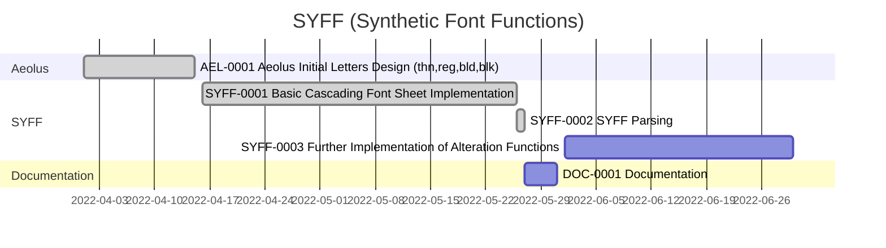

## **Preface**

**SYFF** (Synthetic Font Functions), IPA: [/saɪff/ >= /sɪff/], is an Open Source project of **VivaRado**, Think of it as CSS but for fonts.


<div markdown='1' class="header_logo">


</div>


<div markdown='1' class="sidebar">

### **Contents**

1.  **Preface**
1.  **Introduction**
    1.  **Profile**
    1.  **Project Overview**
    1.  **Organisational Documents**
    1.  **Phase Introduction**
        1.  **Initiation Phase**
            1.  **Business Case**
                1.  **Strategic case**
                1.  **Management case**
                    1.  **Achievements Plan**
            1.  **Project Charter**
                1.  **Project Introduction**
                    1.  **Project Statements**
                1.  **Project Goals**
                1.  **Deliverables**
                1.  **Duration**
        1.  **Planning Phase**
            1.  **Project Plan**
                1.  **Design**
                1.  **Production**
                1.  **Syntax**
                    1.  **Blocks**
                    1.  **Instance Query**
                1.  **Alteration Functions**
                    1.  **Copy**
                    1.  **Translate**
                    1.  **Mirror**
                    1.  **Fontex**
                    1.  **Partial**
                1.  **Examples**
                1.  **Delivery**
                1.  **Usage**
            1.  **Work Plan**
                1.  **Task Assignments**
                1.  **Dependencies**
            1.  **Schedule Plan**
                1.  **Timeline**
            1.  **Stakeholders**
                1.  **Personnel Plan**
                1.  **Communication Plan**
            1.  **Quality Plan**
                1.  **Quality Targets**
                1.  **Quality Management**

### Glossary

1.  **Glossary**

### Reference

1.  **Reference**

</div>

##  **Introduction**

SYFF (Synthetic Font Functions) is a set of cascading functions that recombine and alter a set of initially provided letters to create new letters.

#### Contributors:

*  VivaRado <support@vivarado.com>
*  Andreas Kalpakidis
*  Madina Akhmatova

---

### **Introduction / Profile**

*   Company: VivaRado LLP
*   Designer: Andreas Kalpakidis
*   Twitter: [@vivarado](https://twitter.com/VivaRado)
*   Google Group:[VivaRado Typography Google Group](https://groups.google.com/a/vivarado.com/forum/#!forum/typography)


---


### **Introduction / Project Overview**

*   Project Name: SYFF (Synthetic Font Functions)
*   Code Name: Recombinator
*   Test Type Family: Aeolus
*   Proposal Date: 28/05/2022


---


### **Introduction / Organisational Documents**

Documentation Types:

*  HTML - Responsive preview in HTML format - At README directory
*  Standard Repository README - At the root of the repository
*  PDF - At the root of the repository

Features:

*  Responsive Interface
*  Synchronized Sidebar
*  Hashtag Navigation
*  PDF with TOC and Cover
*  Multilingual Publishing

Drawbacks:

*  Monospace font used in PDF due to kerning issues.


---

### **Introduction / Phase Introduction**

For the sake of simplicity we will only present the following phases:

* Initiation Phase
* Planning Phase


---

### **Introduction / Phase Introduction / Initiation Phase**

*  **Initiation Phase** Components ∞0.001:
	
	1.  **Business Case**:
		*  Strategic case 
		*  Management case

---

### **Introduction / Phase Introduction / Initiation Phase / Business Case**


#### We want to get lots of letters from a few, by running recombining and altering functions whose instructions look like CSS. ####

While working with Advent the Variable variant, we noticed the multiplicity of instances that makes variable fonts great, is exactly what bores the human as a function has to be repeated across all of them. We decided to test a few functions that would take a set of initial letters and twist and stretch them to the point of creating the whole capital letter encoding of three languages, and [here is the initial plan for that.](), since the script we call "recombination" was reusing letters after some functions where applied to them or cascading, a floating idea was to also make these instructions more approachable to the designer by making them appear similar to CSS.


*  **Business Case** Components ∞0.001:
	1.  **Strategic case**
	1.  **Management case**
		* Achievability


---

### **Introduction / Phase Introduction / Initiation Phase / Business Case / Strategic case**

The ability to have a set of simple looking instructions that reduce the repetitive nature of letters would increase the time spent on actually designing the look of the font and improve the time it takes to increase linguistic coverage and deploy the font. Most importantly you can still meddle with your font after the scripts are done doing what you told them.

---

### **Introduction / Phase Introduction / Initiation Phase / Business Case / Management case**

The management case tests the feasibility of the preferred option, in terms of its deliverability within various tolerances. 


#### Achievability:

We have been working with editing fonts with code for a few years now and much of the code and font plumbing existed from projects like [Variomatic](https://github.com/VivaRado/variomatic) or [VRD TYPL](https://github.com/VivaRado/VRD-Typography-Library), the one piece we needed was to make the otherwise complicated list of instructions inside the recombination script, a little more readable and implement a CSS like parser, for that we chose to harvest CSSUtils code.


---

### **Introduction / Phase Introduction / Initiation Phase / Business Case / Management case / Achievements Plan**

1.  **Milestones**
	1.	Recombination Script
	1.  Synthetic Font Functions (SYFF Parsing)
1.  **Dependencies**
	1.  In Lib
1.  **Skillset Requirements**
	1.  Variable Font comprehension.
	1.  Python Programming
	1.  Web Application Development
	1.  Type Design
	1.	2D Vector Math


---

### **Introduction / Phase Introduction / Initiation Phase / Project Charter**


*  **Project Charter** Components ∞0.001:
	*  Project Introduction
	*  Project Goals
	*  Deliverables
	*  Duration

---

### **Introduction / Phase Introduction / Initiation Phase / Project Charter / Project Introduction**

*  **Project Introduction** Components ∞0.001:

	*  Project Statements
		*  Vision Statement
		*  Mission Statement
	*  Project Definition
		*  Problem 
		*  Opportunity

---

### **Introduction / Phase Introduction / Initiation Phase / Project Charter / Project Introduction / Project Statements**

####  Vision Statement:
	
To make SYFF (Synthetic Font Functions) a viable tool in the belt of the type designer.

####  Mission Statement:
	
To make the idea of using SYFF (Synthetic Font Functions) functions the norm during font development and design.


---


### **Introduction / Phase Introduction / Initiation Phase / Project Charter / Project Goals**

*  Goals for ∞ 1.00:
	*  Cascading recombining functions
	*  SYFF Parsing
		*	Media Query Defined Instance
	*  Basic Alterations:
		*	Copy
		*	Transform
		*	Mirror
		*	Fontex
		*	Partial
*  Goals for ∞ 2.00:
	*  Add to Alterations


---


### **Introduction / Phase Introduction / Initiation Phase / Project Charter / Deliverables**

*  **Deliverables** Components ∞0.001:
	*  SYFF (Synthetic Font Functions)
	*  Aeolus Font
	
---

### **Introduction / Phase Introduction / Initiation Phase / Project Charter / Duration**

*  **Duration** of SYFF ∞1.00:
	*  01/04/2022 to 31/05/2022.

*  **Duration** of SYFF ∞2.00:
	*  Stakeholder Decision Pending.

*  **Duration** of Aeolus ∞1.00:
	*  Depends on SYFF ∞1.00.

---


### **Introduction / Phase Introduction / Planning Phase**

The Planning Phase, is where the project solution is further developed in as much detail as possible and the steps necessary to meet the project’s objectives.
The project's **Work Plan / Project Plan** is created outlining the activities, tasks, dependencies, and timeframes.

The Planning Phase consists of:

1. **Project Plan**:
1. **Work Plan**:
1. **Schedule Plan**:
1. **Stakeholders**
1. **Quality Plan (PQP)**


---


### **Introduction / Phase Introduction / Planning Phase / Project Plan**

Decide on the encoding sets and supported language scripts. Decide and plan the weights and how you will generate each weight. Understand the procedures and steps. Calculate or keep track of timelines, steps procedures and pitfalls.

1.  **Project Plan** Components ∞0.001:
	1.  **Design**
	1.  **Production**
	1.  **Alteration Functions**

---

### **Introduction / Phase Introduction / Planning Phase / Project Plan / Design**

BUMP

---

### **Introduction / Phase Introduction / Planning Phase / Project Plan / Production**

BUMP


---

### **Introduction / Phase Introduction / Planning Phase / Project Plan / Syntax**


*  The selector represents to the letter you want to create and the attribute in the square brackets represents the source of that letter.

*  The declaration block contains one or more declarations separated by semicolons.

*  Each declaration includes a SYFF property name and a value, separated by a colon.

*  Multiple SYFF declarations are separated with semicolons, and declaration blocks are surrounded by curly braces.

*  SYFF selectors outside of Instance Queries, apply to all the instances of a given font. Selectors inside Instance Queries apply to specific instances of the font, like Media Queries with devices or sizes.


---

### **Introduction / Phase Introduction / Planning Phase / Project Plan / Syntax / Blocks**


#### Initial Letter Definitions#### 


```css

Π {

	out: "P_i";

}


```


#### Synthesized Letter Definitions#### 


```css

/* produced (character) [ receiving (character) = "name, unicode" ] */

Ш [ Π = "uni0428, 0428" ] {

	transform: fontex("width","right", 100, 0);
	transform: mirrorX();

}


```

---

### **Introduction / Phase Introduction / Planning Phase / Project Plan / Syntax / Instance Query**

SYFF selectors outside of Instance Queries, apply to all the instances of a given font. Selectors inside Instance Queries apply to specific instances of the font, like Media Queries and devices or sizes.


<br>

```css

/* Define the existing letter */

A {

	out: "A_lpha";

}


/* Translate -50 for all instances */

Α [ A = "Alpha, 0391" ] {

	transform: translate(-50, 0);

}


@instance ("bold") {

	/* Translate another -20 for only bold instance */

    Α [ A = "Alpha, 0391" ] {

		transform: translate(-20, 0);

	}

}


```


---


### **Introduction / Phase Introduction / Planning Phase / Project Plan / Alteration Functions**


Review and document the Alteration Functions:

*	Copy
*	Transform
*	Mirror
*	Fontex
*	Partial

### **Introduction / Phase Introduction / Planning Phase / Project Plan / Alteration Functions / Copy**

The definition of a SYFF rule is a copy function.


<br>

```css

A [ B = "name, unicode" ] {}


```

<br>

---

### **Introduction / Phase Introduction / Planning Phase / Project Plan / Alteration Functions / Translate**

Translate a partial or the whole letter.

<br>

```css

A [ B = "name, unicode" ] {

	transform: translate("partial_name", X, Y);
	transform: translate(X, Y);

}


```

<br>

#### Transform Translate Function:#### 

```css
transform: translate("partial_name", X, Y);
transform: translate(X, Y);

<transform()> = translate( <partial-name-string>?, <number>, <number>  )

```

---

### **Introduction / Phase Introduction / Planning Phase / Project Plan / Alteration Functions / Mirror**

Mirror a partial or the whole letter.

<br>

```css

A [ B = "name, unicode" ] {

	transform: mirrorX();
	transform: mirrorX( "hand_copy" );
	transform: mirrorY();
	transform: mirrorY( "hand_copy" );

}


```
<br>

#### Transform Mirror Function:#### 

```css
transform: mirrorX();
transform: mirrorY("hand_copy");

<transform()> = mirrorX( <partial-name-string>? )
<transform()> = mirrorY( <partial-name-string>? )

```

<br>

---

### **Introduction / Phase Introduction / Planning Phase / Project Plan / Alteration Functions / Fontex**

Fontex is defined as an instance like all the rest of the instances of your font, but it includes areas, instead of letters, defined by you for specific purposes.


<br>

<div markdown='1' class="img_narrow">


</div>

<br>

Here we can translate the points in the left width region.

<br>

<div markdown='1' class="img_narrow">


</div>


<br>

```css

A [ B = "name, unicode" ] {

	transform: fontex("type","position", X, Y);

}

```
<br>


#### Transform Fontex Function:#### 

```css
transform: fontex("type","position", X, Y);

<transform()> = fontex( <type-string>, <position-string>, <number>, <number> )

```

<br>

Here is a GLIF with some areas defined by fontex, using these areas we can then manipulate the included points. Since fontex is tied to the first instance of your font, and we are dealing with a variable font, those points are at the same index and same partial across all other instances too.

We can then use these fontex to move points and make letters wider or other detailing.

<br>

```xml

<?xml version="1.0" encoding="UTF-8"?>
<glyph name="Pi" format="1">
  <advance width="679"/>
  <unicode hex="03A0"/>
  <outline>
    <contour>
      <point x="-25" y="-20" type="line" name="{type:width,position:left}"/>
      <point x="152" y="-20" type="line" />
      <point x="152" y="674" type="line" />
      <point x="-25" y="674" type="line" />
    </contour>
    <contour>
      <point x="385" y="-20" type="line" name="{type:width,position:right}"/>
      <point x="562" y="-20" type="line" />
      <point x="562" y="674" type="line" />
      <point x="385" y="674" type="line" />
    </contour>
  </outline>
</glyph>


```

---

### **Introduction / Phase Introduction / Planning Phase / Project Plan / Alteration Functions / Partial**

You can divide your letter in partials which you can use across your other letters, you could also make one letter that includes all the partials you will need and then run the appropriate SYFF functions to create the whole font.

<br>

```css

A [ B = "name, unicode" ] {

	partial: keep("partial_a", "partial_b");
	partial: remove("partial_b");
	partial: get("Π","partial_a","partial_a_rename");
	partial: copy("partial_a");

}


```

<br>

#### Partial Keep Function:#### 

```css
partial: keep("partial_a", "partial_b");

<partial()> = keep( [<partial-name-string> , <partial-name-string>, ...] )

```

#### Partial Remove Function:#### 

```css
partial: remove("partial_b");

<partial()> = remove( [<partial-name-string> , <partial-name-string>, ...] )

```

#### Partial Get Function:#### 

```css
partial: get("Π","partial_a","partial_a_rename");

<partial()> = get( <letter-name-string> , <partial-name-string>, <partial-new-name-string> )

```

#### Partial Copy Function:#### 

```css
partial: copy("partial_a");

<partial()> = copy( <partial-name-string>, <partial-new-name-string>? )


```

<br>


---


### **Introduction / Phase Introduction / Planning Phase / Project Plan / Examples**

#### E to F to Γ to T#### 

Here is an example of the letter E becoming F, then Γ and T. The first point of each part of this letter have a piece of code in the name definition that allows us access with SYFF.

<br>

```fontex
{type:part,position:hand}

```

<br>


<br>

<div markdown='1' class="img_narrow">


</div>


```css

Ε {

	out: "E_psilon";

}

/* We create a new letter out of the Epsilon glyph */

E [ Ε = "E, 0045" ] {}

/* 
We create a new letter F and then use the partial function, 
by keeping and removing the curved "leg" partial,
we need a new straight leg - stem for F and we can grab that from the letter I
*/

F [ E = "F, 0046" ] { 

	partial: keep("hand","arm","tie","leg"); /* Demonstrating Partial Keep and Remove */
	partial: remove("leg");
	partial: get("I","leg","leg_new"); /* get and rename */

}

/* 
We create a new letter Γ (Gamma) and then use the partial function and removing the "tie" partial.
*/

Γ [ F = "Gamma, 0393" ] { 

	partial: remove("tie");

}

/* 
We create a new letter Τ (Tau) and then use the partial function and removing the "arm" partial, 
then we copy the "hand" partial which gives us "hand_copy" (or hand_001 subject to change), 
finally we mirror "hand_copy" and translate it -100 on the X axis.
*/

Τ [ Γ = "Tau, 03A4" ] { 

	partial: remove("arm");
	partial: copy("hand", "hand_copy");
	transform: mirrorY( "hand_copy" );
	transform: translate("hand_copy", -100, 0);

}

/*
And here is a copy of Tau to create T
*/

Τ [ T = "T, 0054" ] {}


```

<br>

The glif in question:

<br>


```xml

<?xml version="1.0" encoding="UTF-8"?>
<glyph name="Epsilon" format="1">
  <advance width="415"/>
  <unicode hex="0395"/>
  <outline>
    <contour>
      <point x="115" y="559" type="line" name="{type:part,position:hand}"/>
      <point x="115" y="650" type="line"/>
      <point x="415" y="650" type="line"/>
      <point x="415" y="580" type="line"/>
      <point x="360" y="559" type="line"/>
    </contour>
    <contour>
      <point x="0" y="338" type="line" name="{type:part,position:arm}"/>
      <point x="0" y="579" type="line"/>
      <point x="64" y="650" type="line"/>
      <point x="119" y="650" type="line"/>
      <point x="119" y="559" type="line"/>
      <point x="105" y="559" type="line"/>
      <point x="91" y="544" type="line"/>
      <point x="91" y="338" type="line"/>
    </contour>
    <contour>
      <point x="278" y="293" type="line" name="{type:part,position:tie}"/>
      <point x="67.6692" y="292.585" type="line"/>
      <point x="67.6692" y="383.588" type="line"/>
      <point x="320.628" y="383.715" type="line"/>
      <point x="320.628" y="336" type="line"/>
    </contour>
    <contour>
      <point x="91" y="342" type="line" name="{type:part,position:leg}"/>
      <point x="91" y="106" type="line"/>
      <point x="105" y="91" type="line"/>
      <point x="119" y="91" type="line"/>
      <point x="119" y="0" type="line"/>
      <point x="64" y="0" type="line"/>
      <point x="0" y="71" type="line"/>
      <point x="0" y="342" type="line"/>
    </contour>
    <contour>
      <point x="115" y="0" type="line" name="{type:part,position:foot}"/>
      <point x="115" y="91" type="line"/>
      <point x="360" y="91" type="line"/>
      <point x="415" y="70" type="line"/>
      <point x="415" y="0" type="line"/>
    </contour>
  </outline>
</glyph>


```

---


### **Introduction / Phase Introduction / Planning Phase / Project Plan / Delivery**

SYFF will be delivered in this repository.

---

### **Introduction / Phase Introduction / Planning Phase / Project Plan / Usage**


####  **To apply the SYFF:**

Planned:

```python3 '/syff.py' -s '/font.designspace' -c '/font.syff' --output-path '/adventpro-VF.ufo'```

---

Current Test:

```python3 '/syff.py' -s '/demo.syff'```


---

### **Introduction / Phase Introduction / Planning Phase / Work Plan**


SYFF **Work Plan** is created outlining the activities, tasks, dependencies, and timeframes.

*  Work Plan:
	*  Tasks Assignments
	*  Dependencies

---


### **Introduction / Phase Introduction / Planning Phase / Work Plan / Task Assignments**

*  **Docs Update**:
	*  VivaRado, Andreas Kalpakidis (∞1):
*  **SYFF**:
	*  VivaRado, Andreas Kalpakidis (∞1):

---

### **Introduction / Phase Introduction / Planning Phase / Work Plan / Dependencies**

SYFF currently has all the dependencies met for a successful delivery.

---

### **Introduction / Phase Introduction / Planning Phase / Schedule Plan**

Overview:





*  Current:
    *  ~~**AEL-0001** / from April 01 2022 to April 15 2022~~:
        *  **Aeolus ∞1.000**
            *  Design of the first 9 letters of Aeolus
    *  ~~**SYFF-0001** / from April 16 2022 to May 26 2022~~:
        *  **Recombinator ∞1.000**
        *  **Copy ∞1.000**
        *  **Partials ∞1.000**
        *  **Fontex ∞1.000**
    *  ~~**SYFF-0002** / from May 26 2022 to May 27 2022~~:
        *  **SYFF Parsing ∞1.000**
    *  **DOC-0001 ∞1.000** / from May 27 2022 to May 31 2022:
        *  Formulating the Documentation Structure
        *  Explaining the Alteration Functions
    *  **SYFF-0003** / from June 01 2022 to June 30 2022:
        *  Implementing the Alteration Functions

<small>Strike Through Equals Completion</small>


Task Codes:

*  AEL-∞-∞: Aeolus Test Font
*  SYFF-∞-∞: Synthetic Font Functions
*  DOC-∞-∞: Documentation


---

### **Introduction / Phase Introduction / Planning Phase / Schedule Plan / Timeline**


-  **2022-05-27**: After having the basic parts of the scripts in question and the required design files, we proceed to create the documentation and explore all the rest of the parts that need further development and refining.


---


### **Introduction / Phase Introduction / Planning Phase / Stakeholders**

We identify the **Stakeholders** by a **Personnel Plan** and create a **Communication Plan** to keep the **Stakeholders** informed.


*  **Stakeholders** Components:

	*  Applicable Stakeholders (Concious and Unconcious Entities):
		*  clients
		*  personell
		*  funders
		*  suppliers
		*  equipment
	*  Glyph Design Team (GyT)
	*  Kern Testing Team (KeT)
	*  Quality Assurance Team (QaT)
	*  Programming Team (PgT)

### **Introduction / Phase Introduction / Planning Phase / Stakeholders / Personnel Plan**

*  Personnel Plan
	*  Organizational Structure
		*  team members
			*  internal
				*  Andreas Kalpakidis (∞1)
				*  Madina Akhmatova (∞1)
	*  Responsibilities and Qualifications
		*  Project Management and Accounting: Madina Akhmatova (∞1)
		*  Planning, Development and Design: Andreas Kalpakidis (∞1)

---

### **Introduction / Phase Introduction / Planning Phase / Stakeholders / Communication Plan**

*  Communication Plan
	*  Stakeholder Feedback Mechanisms
		*  Weekly Notifications
			*  Twitter
			*  LinkedIn
	*  User Feedback Mechanisms:
		*  <support@vivarado.com>

---


### **Introduction / Phase Introduction / Planning Phase / Quality Plan**

A **Quality Plan** describes the activities, standards, tools and processes necessary to achieve quality in the delivery of a project.

We can now create a **Quality Plan** by identifying the valid **Quality Targets** we want to achieve. Identify the **Quality Policies** that will be required to achieve them. Identify how to do **Quality Measurement**. Lastly identify how to maintain quality with **Quality Management**.


*  **Quality Plan (PQP)** Components:
	
	1.  Quality Targets
	1.  Quality Management

---

### **Introduction / Phase Introduction / Planning Phase / Quality Plan / Quality Targets**

**Quality Targets** we want to achieve and what are their **Acceptance Criteria**, **Quality Management Procedures**, for each **Applicable Category**

1.  Quality Targets Components:
	*  Acceptance criteria
	*  Quality Management procedures

---

### **Introduction / Phase Introduction / Planning Phase / Quality Plan / Quality Management**

**Quality Management**, the nature of the **Audits**, **Work Verification** by assigning responsible personnel for **Task Fulfillment** and **Task Checking**.

1.  Quality Management
	*  Audits
	*  Tool Scheduling
	*  Work Verification
		*  Task fulfillment responsible personnel 
			*  VivaRado
		*  Task checking responsible personnel
			*  VivaRado


---


### **Glossary**

**SYFF**: SYFF (Synthetic Font Functions), IPA: [/saɪff/ >= /sɪff/].

---

### **Reference**

CSSUtils: [cssutils on pypi.org](https://pypi.org/project/cssutils/)

---