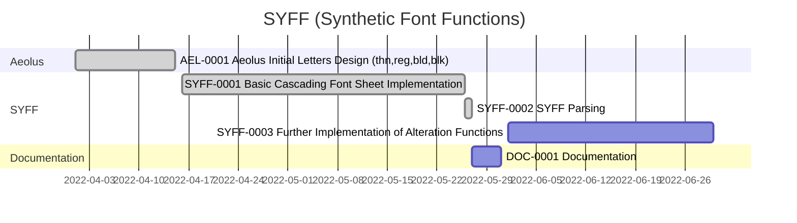

Overview:

*  Current:
    *  ~~**AEL-0001** / from April 01 2022 to April 15 2022~~:
        *  **Aeolus ∞1.000**
            *  Design of the first 9 letters of Aeolus
    *  ~~**SYFF-0001** / from April 16 2022 to May 26 2022~~:
        *  **Recombinator ∞1.000**
        *  **Copy ∞1.000**
        *  **Partials ∞1.000**
        *  **Fontex ∞1.000**
    *  ~~**SYFF-0002** / from May 26 2022 to May 27 2022~~:
        *  **SYFF Parsing ∞1.000**
    *  **DOC-0001 ∞1.000** / from May 27 2022 to May 31 2022:
        *  Formulating the Documentation Structure
        *  Explaining the Alteration Functions
    *  **SYFF-0003** / from June 01 2022 to June 30 2022:
        *  Implementing the Alteration Functions

<small>Strike Through Equals Completion</small>

Task Codes:

*  AEL-∞-∞: Aeolus Test Font
*  SYFF-∞-∞: Synthetic Font Functions
*  DOC-∞-∞: Documentation
